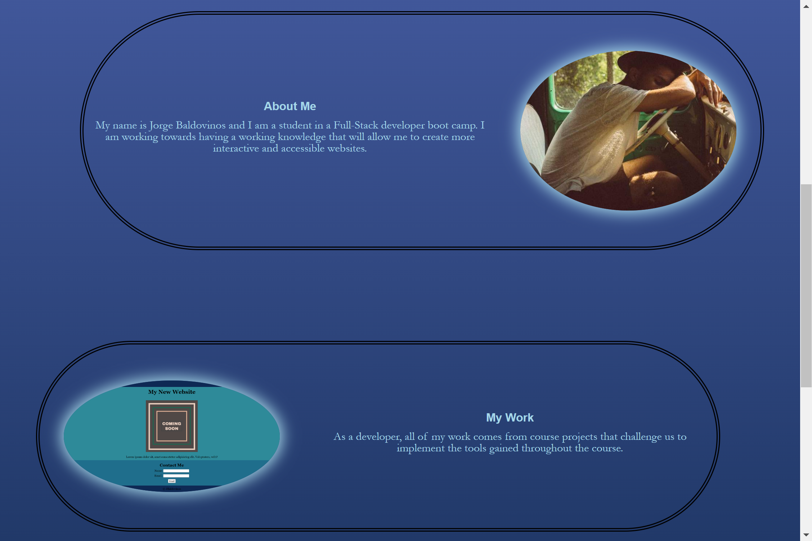
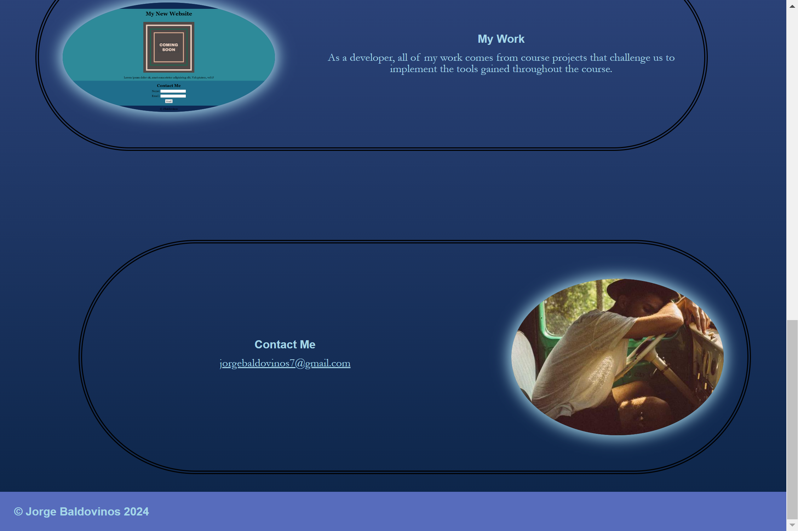

# Web Developer Portfolio

## Description

This [portfolio](https://jorge-baldovinos.github.io/Web-Developer-Portfolio/) introduces Jorge Baldovinos as a Full-Stack Web Developer student. The site includes a navigation bar with hyperlinks to the corresponding information on the site. The links take you to an "about" section, a "my work" section, and a "contact me" section.

## Usage 
You can click on the hyperlinks located at the top right of the navigation bar to instantly scroll to each section on the site. You can scroll all the way down to the "Contact Me" section where you can click on the email link to directly email the site administrator. 

## License

Please refer to the LICENSE in the repo.
